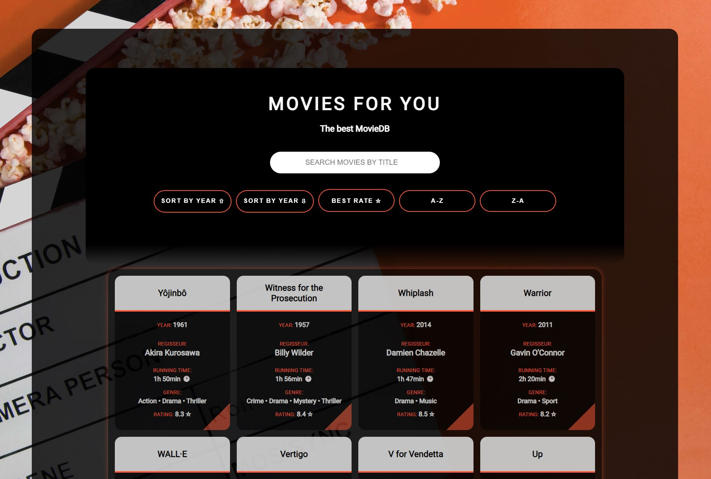

# Movie Datenbank – REACT-Projekt

## Beschreibung

Dieses REACT-Projekt wurde im Rahmen eines Coding-Bootcamps bei supercode.de erstellt. Es handelt sich um eine Movie Datenbank, bei der die Filme aus einer JSON-Datei beim Laden der Seite angezeigt werden.

### Die Anwendung bietet folgende Möglichkeiten:

- Suche nach einem bestimmten Film
- Sortierung der Datenbank nach Erscheinungsjahr (aufsteigend/absteigen), nach der Bewertung (absteigend) und alphabetisch von A nach Z und von Z nach A.

## Funktionsweise

1. Filmnamen oder einen Teil davon in das Suchefeld eingeben
2. Filme, die dem Suchstring entsprechen, werden direkt angezeigt 
3. Werden keine Filme gefunden erscheint eine Error-Meldung
4. Zur Sortierung der Filme auf den entsprechenden Button "Sort by Year Up", "Sort by Year Down", "Best Rate", A-Z oder Z-A klicken.
5. Die sortierten Filme werden wieder entsprechend ausgegeben.

## Tools/Technologien
- HTML5
- SCSS
- REACT

## Screenshot

### Ansicht der Webseite

## Netlify Live Vorschau

Du findest eine Live Vorschau auf Netlify: [Netlify Live Vorschau](https://reactjs-movie-db-rainer-busch.netlify.app/)

## GitHub Repository

Du findest das gesamte Projekt auf GitHub: [GitHub Repository](https://github.com/w1tch3r-code/reactjs_movie_db)

## To Do's
- Weitere Funktionalitäten hinzufügen (Filme hinzufügen, bearbeiten, löschen)

## Anmerkungen

- Dieses Projekt wurde im Rahmen eines Coding-Bootcamps bei supercode.de erstellt.
- Die Anwendung ermöglicht eine einfache und schnelle Suche in einer Movie-Datenbank und die Sortierung der Filme.
- Die README.md-Datei dient auch als Bewerbungsunterlage und präsentiert meine Fähigkeiten in der Webentwicklung.
